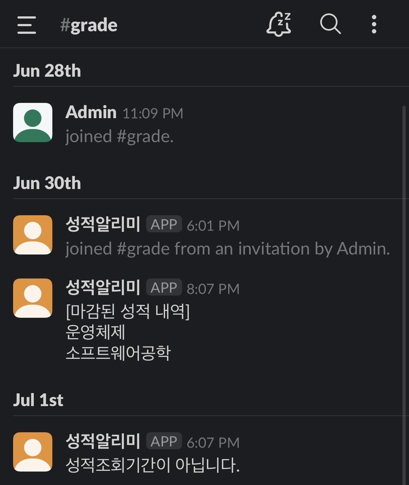

# grade-notification
grade notification using python, slack bot

### Screenshot

### Usage
- Only can use with khuis(KyungHee University Official System).
- Notify when grade is updated.
- Use Slack bot, deployed with HEROKU.
- Set scheduler works at intervals of 2 hours.
- It needs to be upgraded. (It doesn't work well.)
